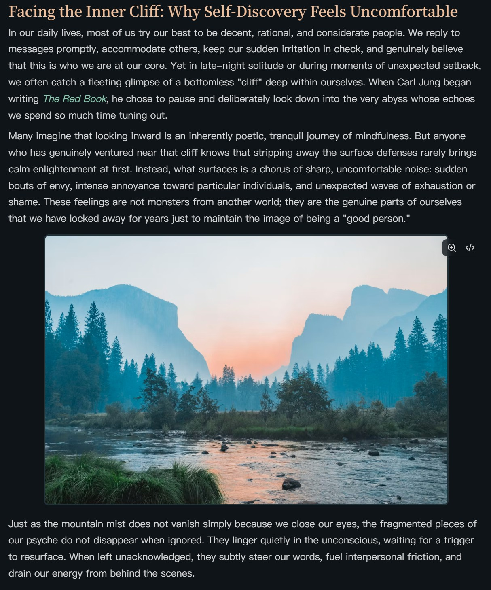
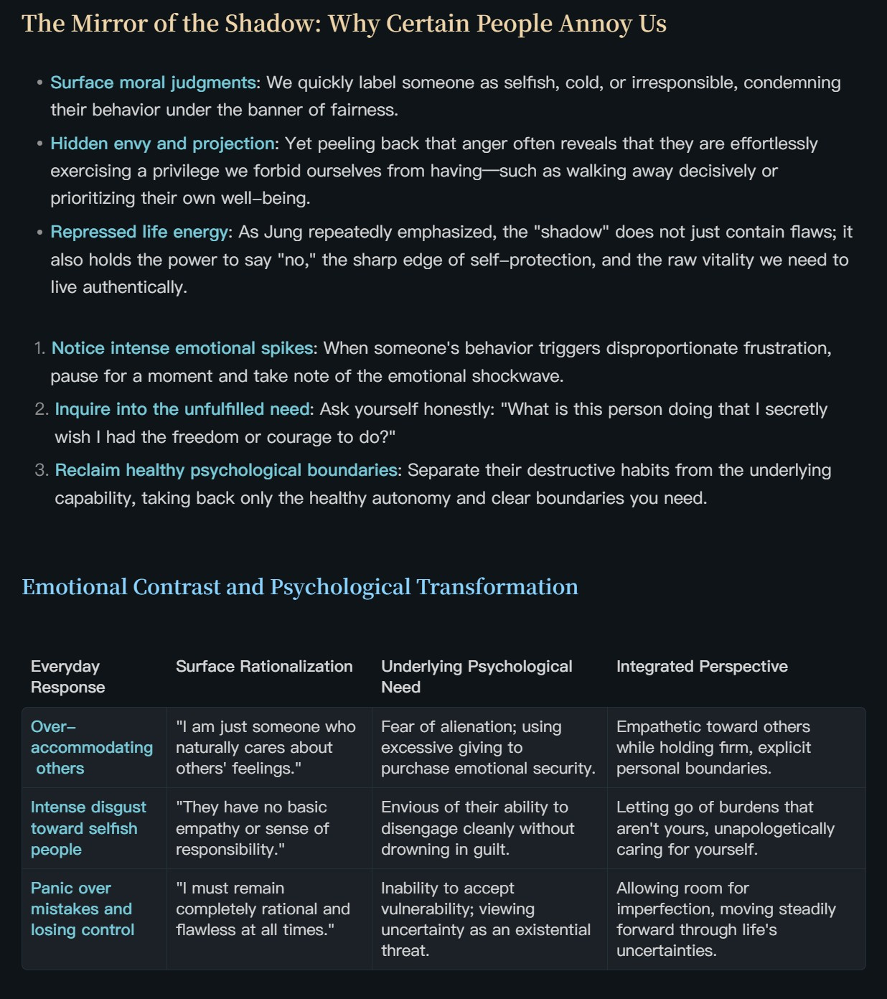
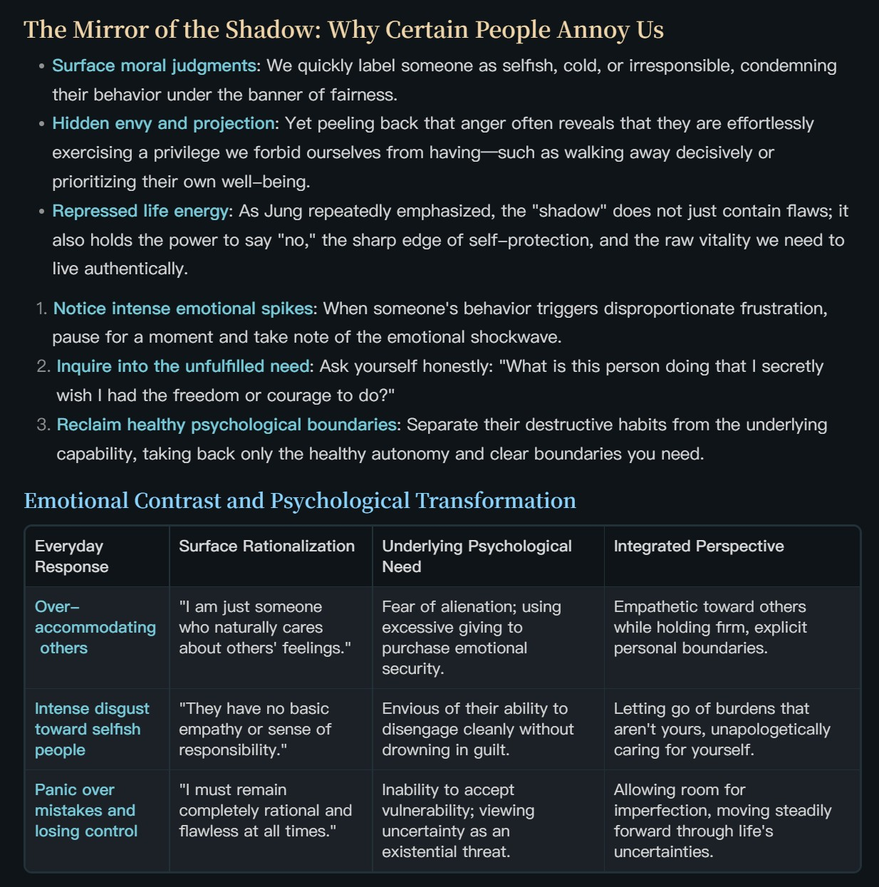
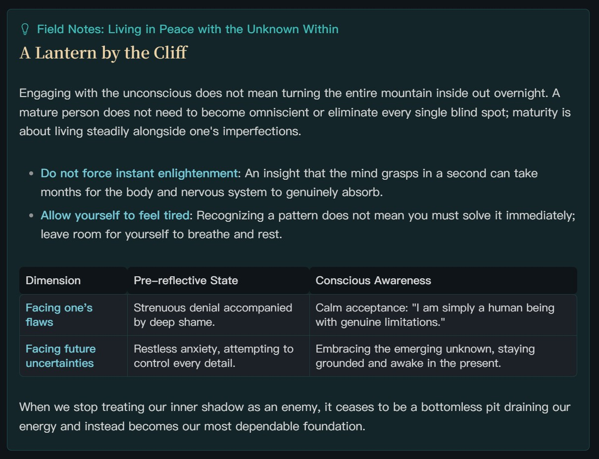
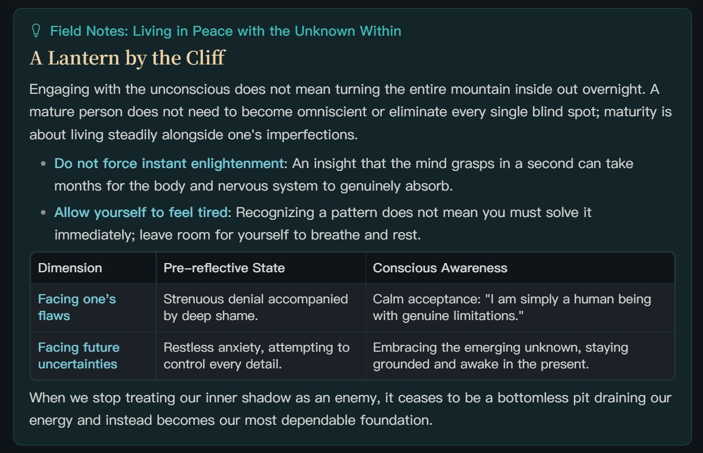

# Refined Layout

> [!NOTE] Fixed an issue where the cursor skipped some blank lines when moving up or down with the arrow keys.
> In editing mode, Up/Down now stop at blank lines compressed by the plugin. Shift+Up/Down also extends selections across these lines.

**English** | [简体中文](README_zh-CN.md)

Refined Layout is an Obsidian plugin for adjusting the layout and typography of your notes. Without writing CSS (styling code), you can change the line height, spacing, and appearance of body text, lists, headings, images, tables, callouts, blockquotes, code blocks, and Mermaid diagrams from the settings page.

The plugin provides separate configurations for **Live Preview (editing mode)** and **reading mode**. You can choose which layout modules to enable and set different values for each mode. Changes take effect immediately and are saved automatically.

## Before and After

The following comparisons show three examples: body paragraphs with an image, lists and tables, and a callout. These demonstrate only part of what the plugin offers; the full feature overview follows below.

The screenshots retain the colors and fonts of the theme used for the examples. They show layout adjustments within that theme, rather than Obsidian’s default theme. You can adjust the settings to suit your own theme and reading preferences without matching the style shown here.

### Body Paragraphs and Images

Adjust body line height, paragraph spacing, and image width, corners, borders, and vertical spacing to balance images with the surrounding text.

| Before | After |
| :---: | :---: |
|  |  |

### Lists and Tables

Control spacing between list items separately from the space around the entire list. For tables, adjust cell padding, inner and outer borders, rounded corners, and the space between the table and nearby headings or paragraphs.

| Before | After |
| :---: | :---: |
|  |  |

### Callouts

Set independent spacing for headings, paragraphs, lists, and tables inside a callout. Adjust the card’s rounded corners and inner and outer spacing to give mixed content a clear structure.

| Before | After |
| :---: | :---: |
|  |  |

## Features

### Body Text and Lists

- **Body line height**: Adjust the vertical distance between lines of ordinary body text.
- **Blank lines and paragraphs**: Set the height of actual blank lines in editing mode and paragraph spacing in reading mode.
- **List item spacing**: Adjust the top and bottom spacing between list items separately.
- **Overall list spacing**: Adjust the space above the first item and below the last item to control the distance from surrounding content. At these two boundaries, overall list spacing applies without adding item spacing on top of it.

### Headings and Decorative Lines

Set line height, top spacing, and bottom spacing independently for H1–H6 (heading levels 1 through 6). When a document starts with a heading on its first line, you can also fine-tune the space above it.

For heading decorations already supplied by a theme, the plugin can adjust horizontal position, width, rounded corners, distance from the text, and the height and vertical offset for each heading level. This feature targets decorations created with the theme’s `::before` pseudo-element (a decorative element generated by CSS). It does not add decorations to themes that do not provide them.

### Callouts

Callouts have layout settings independent of ordinary body text, with controls for both the card itself and its contents.

- **Card appearance**: Rounded corners, top and bottom margins, and padding on all four sides.
- **Title bar**: Text line height and padding on all four sides, with separate top and bottom spacing for title-only and collapsed callouts.
- **Body text and lists**: Body line height, paragraph spacing, list item spacing, and overall list spacing. A list at the end of a callout can have its own bottom spacing.
- **Headings**: Independent line height and vertical spacing for H1–H6.
- **Images**: Maximum width, rounded corners, and borders.
- **Tables**: Cell padding, inner and outer borders, rounded corners, and vertical spacing.

### Blockquotes

Independently adjust body line height, paragraph spacing, list item spacing, and overall list spacing inside blockquotes. Internal H1–H6 headings have their own line height and vertical spacing settings, while tables support padding, borders, rounded corners, and vertical spacing.

### Images

Set the maximum width of ordinary body images relative to the content area, along with corner radius, border width, and spacing above and below.

In editing mode, image spacing and actual blank lines in the Markdown are controlled separately: adjust the space around images in the Images section, and the height of actual blank lines in the Body Text and Lists section. Images inside callouts use their dedicated settings.

### Tables

For tables in the main body, adjust cell padding, inner border width, outer border width, overall corner radius, and the distance from surrounding content. Tables inside callouts and blockquotes use the settings in their respective sections.

### Code Blocks

Both modes support code line height adjustments. Editing mode also lets you adjust blank line spacing inside code blocks, while reading mode provides separate controls for the space above and below the entire block.

### Spacing After Headings

When a heading is immediately followed by a paragraph, list, blockquote, code block, table, image, or callout, you can adjust the gap according to the content type. Separate settings are available for headings in the main body, callouts, and blockquotes. Editing mode also lets you adjust the height of blank lines after headings.

### Mermaid Diagrams

Mermaid generates flowcharts and other diagrams from text syntax. The plugin uses each diagram’s original aspect ratio to distinguish portrait diagrams from standard or landscape diagrams, with three controls:

- **Portrait aspect ratio threshold**: Define which width-to-height ratios count as portrait.
- **Portrait maximum width**: Display portrait diagrams centered at their original size without enlarging them. Scale them down proportionally only when they exceed the configured percentage of the content width.
- **Landscape minimum width**: Preserve a minimum width for standard or landscape diagrams and allow horizontal scrolling when there is not enough space.

## Usage and Configuration

Once the plugin is enabled, open **Refined Layout** in Obsidian’s settings.

1. Select the editing or reading mode you want to configure.
2. Open the relevant section, enable modules as needed, and adjust the values.
3. Return to your note to see the result. Changes apply immediately and are saved automatically.

Module toggles and layout values are independent for the two modes. Some settings also differ between modes because the editing and reading views have different structures.

### Restoring Defaults and Moving Settings

- **Reset section**: Restore only the settings for the current section.
- **Reset all**: Restore both editing and reading configurations, including all module toggles, while keeping your interface language choice.
- **Export settings**: Save the complete configuration for both modes as a JSON file for backup or transfer.
- **Import settings**: Read settings from a JSON file and replace the current configuration immediately after a successful import. Export a backup first if you want to keep your existing settings.

### Interface Languages

The settings page supports following Obsidian’s language, Simplified Chinese, Traditional Chinese (Taiwan), English, and Japanese. Manual language changes take effect immediately and are saved. When following Obsidian, the plugin uses English if the language is unsupported or cannot be detected.

### Settings Search

Language, import/export, and reset controls are on the settings home page. Switch between **Editing view** and **Reading view**, then open a category to edit its settings. Navigation has only two levels, and each view keeps its own values and module switches.

On Obsidian 1.13 or later, native settings search covers the currently selected view, including all H1–H6 levels. Switching the view on the home page updates both category contents and search results. Earlier supported versions use the same two-level layout without native settings search.

## Scope and Compatibility

The plugin primarily adjusts ordinary notes in Live Preview and reading mode, with style isolation for Canvas, DataviewJS (views generated by scripts), and elements inside Mermaid diagrams. Mermaid settings control the size and layout of the diagram as a whole, rather than the styling of node text or connecting lines.

The final appearance also depends on your theme, CSS snippets, and other layout plugins. If part of a note looks different from what you expect, try disabling the corresponding module and checking for overlapping layout settings.

## Feedback and License

For build commands and the manual release preparation workflow, see [Development and release builds](DEVELOPMENT.md).

Bug reports and suggestions are welcome through GitHub Issues. When reporting a display issue, please include your Obsidian version, theme, and the mode in which it occurs, along with a short note sample or screenshot that helps reproduce the issue.

This project is licensed under the MIT License.
