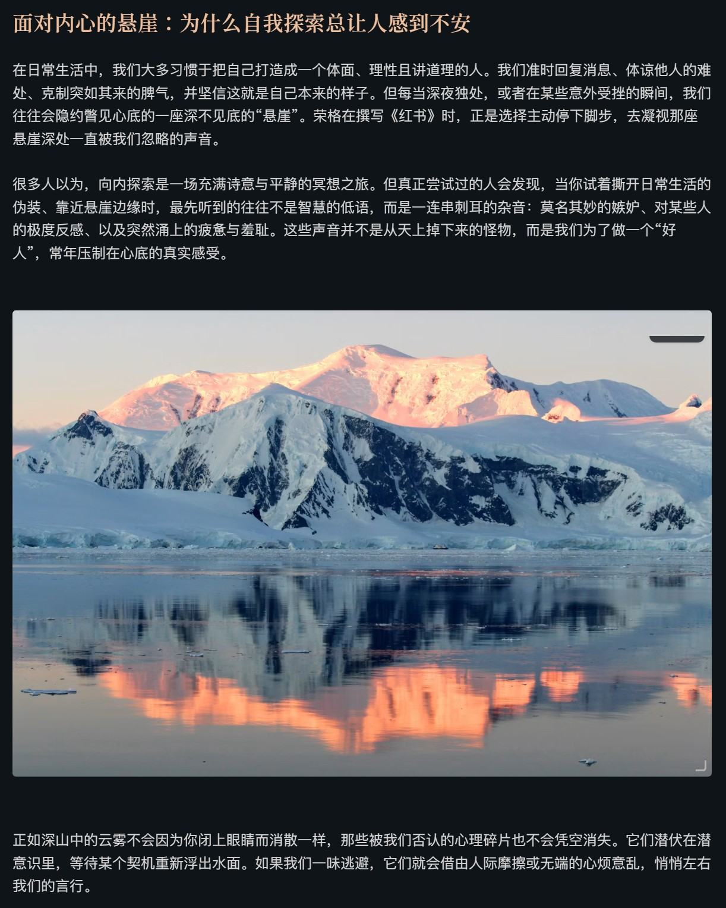
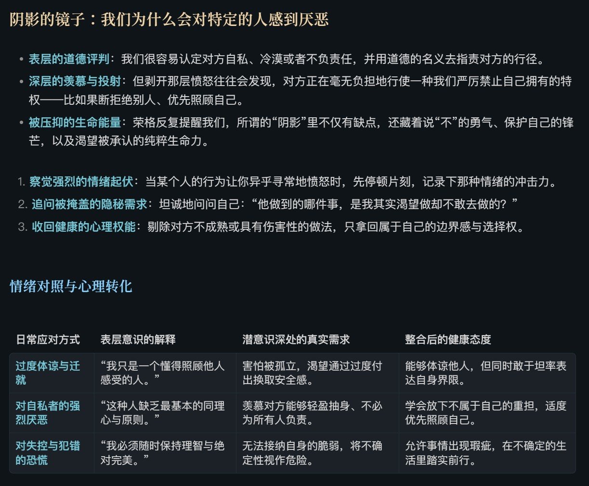
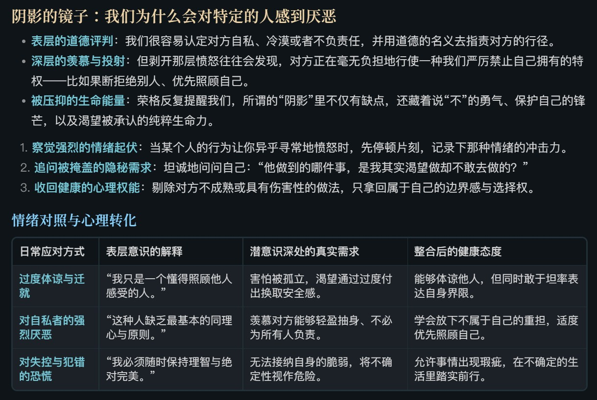
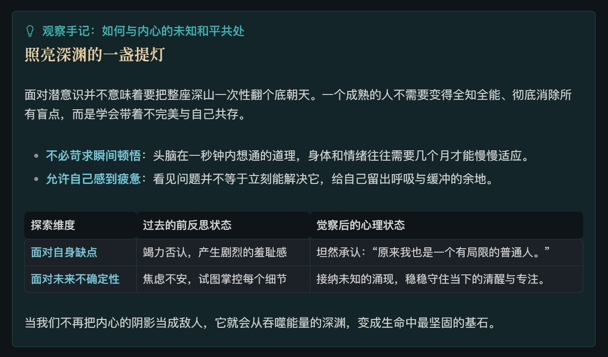
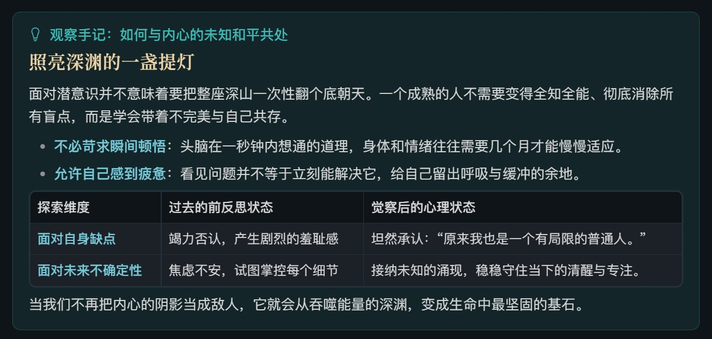

# Refined Layout

> [!WARNING]
> **使用前请留意：编辑模式中的光标导航存在已知限制。**
> 启用本插件后，CodeMirror（Obsidian 使用的文本编辑器）的行选择器会表现异常，使上、下方向键无法正常地纵向移动输入光标。这是 Obsidian 的问题，Refined Layout 无法修复。如果你依赖方向键逐行编辑，请在使用前考虑这一限制。

[English](README.md) | **简体中文**

Refined Layout 是一个用于调整 Obsidian 笔记布局与排版的插件。无需编写 CSS（样式代码），你就可以在设置页中调整正文、列表、标题、图片、表格、Callout（提示块）、引用块、代码块和 Mermaid 图表的行高、间距与外观。

插件为 **实时预览（编辑模式）** 和 **阅读模式** 提供两套独立配置。你可以分别选择启用哪些排版模块，并为两种模式设置不同的参数。修改即时生效并自动保存。

## 排版效果

以下选取三组内容展示启用前后的变化：包含图片的正文段落、列表与表格，以及 Callout。它们只是部分功能示例，完整功能介绍见下文。

截图保留了所用主题的配色与字体，展示的是该主题下的排版调整效果，并非 Obsidian 默认主题。你可以根据自己的主题与阅读习惯调整参数，无需使用与截图相同的样式。

### 正文段落与图片

调整正文行高、段落之间的留白，以及图片的最大宽度、圆角、边框和上下间距，让图片与文字保持合适的比例。

| 启用前 | 启用后 |
| :---: | :---: |
|  |  |

### 列表与表格

分别控制列表条目之间的间距、整个列表与前后内容的距离；为表格调整单元格内边距、内外框线、圆角，以及与标题和正文之间的留白。

| 启用前 | 启用后 |
| :---: | :---: |
|  |  |

### Callout

为 Callout 内部的标题、正文、列表和表格设置独立间距，同时调整卡片的圆角与内外留白，让多种内容放在同一卡片中时仍有清晰的层次。

| 启用前 | 启用后 |
| :---: | :---: |
|  |  |

## 功能介绍

### 正文与列表

- **正文行高**：调整普通正文每行文字之间的距离。
- **空行与段落**：编辑模式可调整实际空行的高度；阅读模式可调整段落间距。
- **列表条目间距**：分别调整条目之间的上、下间距。
- **列表整体间距**：分别调整列表首项上方和末项下方的留白，控制列表与前后内容的距离。列表首末两端使用整体间距，不与条目间距叠加。

### 标题与装饰线

H1–H6（一级至六级标题）可以分别设置行高、上间距和下间距；文档第一行就是标题时，还可以单独微调顶部留白。

对于主题已有的标题装饰线，插件可以调整水平位置、宽度、圆角、与文字的距离，以及各级标题装饰的高度和垂直偏移。这项功能针对主题通过 `::before` 伪元素（由样式生成的装饰元素）提供的装饰；主题没有相应装饰时，插件不会额外添加。

### Callout（提示块）

Callout 拥有独立于普通正文的排版设置，既可以调整整张卡片，也可以细调内部内容。

- **卡片外观**：圆角、上下外边距，以及上、下、左、右内边距。
- **标题栏**：文字行高与四周内边距，并为仅有标题和折叠状态分别设置上下留白。
- **内部正文与列表**：正文行高、段落间距、列表条目间距和整体间距；列表位于卡片末尾时，可单独设置底部间距。
- **内部标题**：分别调整 H1–H6 的行高与上下间距。
- **内部图片**：最大宽度、圆角与边框。
- **内部表格**：单元格内边距、内外框线、圆角与上下间距。

### 引用块

引用块中的正文行高、段落间距、列表条目间距和整体间距可以单独设置。内部 H1–H6 标题也有各自的行高与上下间距，表格则支持内边距、边框、圆角和上下间距调整。

### 图片

调整普通正文图片相对于内容区域的最大宽度，并设置圆角、边框宽度和上下留白。

编辑模式中，图片间距与 Markdown 中实际存在的空行分别控制：图片周围的留白在图片分区调整，实际空行的高度在「正文与列表」分区调整。Callout 内部图片使用其专属设置。

### 表格

正文表格支持调整单元格内边距、内部框线宽度、外边框宽度、整体圆角，以及表格与前后内容的距离。Callout 和引用块中的表格分别使用各自分区中的设置。

### 代码块

两种模式均可调整代码行高。编辑模式还可调整代码块内部空行间距，阅读模式则可分别调整代码块整体的上、下间距。

### 标题后首元素

标题后面紧接正文、列表、引用块、代码块、表格、图片或 Callout 时，可以按内容类型分别调整衔接间距。正文、Callout 和引用块内的标题衔接均有对应设置；编辑模式还可调整标题后空行的高度。

### Mermaid 图表

Mermaid 是通过文本语法生成流程图等图表的工具。插件根据图表原始宽高比区分纵向图与普通或横向图，并提供三项控制：

- **纵向判定宽高比**：设置何种比例的图表被视为纵向图。
- **纵向图最大宽度**：纵向图按原始尺寸居中显示，不主动放大；超过设定的正文宽度比例时才等比缩小。
- **横向图最小宽度**：为普通或横向图保留所需宽度，显示空间不足时允许横向滚动。

## 使用与配置

启用插件后，在 Obsidian 的设置中打开 **Refined Layout**。

1. 选择需要调整的「编辑模式」或「阅读模式」。
2. 进入对应功能分区，按需启用模块并修改数值。
3. 返回笔记查看效果；设置会即时应用并自动保存。

两种模式的模块开关与排版参数彼此独立。由于编辑与阅读视图的结构不同，部分设置项也会随模式变化。

### 恢复默认值与配置迁移

- **恢复本区默认值**：只恢复当前分区对应的设置。
- **全部重置**：恢复编辑、阅读两套排版配置及全部模块开关，保留界面语言选择。
- **导出配置**：将两种模式的完整配置导出为 JSON 文件，方便备份或迁移。
- **导入配置**：从 JSON 文件读取配置，成功后立即替换当前配置。若要保留现有设置，可先导出备份。

### 界面语言

设置页支持「跟随 Obsidian」、简体中文、繁體中文（台灣用語）、English 和日本語。手动切换后立即生效并保存；选择跟随 Obsidian 时，若其语言不在支持范围内或无法识别，则使用 English。

## 适用范围与兼容性

插件主要调整普通笔记在实时预览和阅读模式下的排版，并对 Canvas（白板）、DataviewJS（脚本生成的视图）和 Mermaid 图内元素做了样式隔离。Mermaid 设置用于整图的尺寸与布局，不用于修改图中节点文字和连线的样式。

最终显示效果也会受到主题、CSS 代码片段和其他排版插件的影响。如果某部分效果与预期不符，可以先关闭对应模块，检查是否存在重叠的排版设置。编辑模式中的方向键光标导航限制请参阅本文开头的提醒。

## 反馈与许可

欢迎通过 GitHub Issues 反馈问题或提出建议。反馈显示问题时，请尽量说明 Obsidian 版本、所用主题、发生问题的模式，并附上能够复现问题的简短笔记内容或截图。

本项目采用 MIT 开源许可证。
