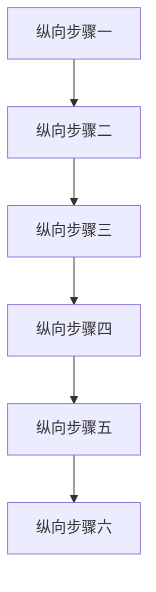

# Mermaid 自适应宽度

请分别在 Live Preview 与阅读模式中检查本页。默认设置应为：纵向图最大宽度 35%、纵向判定宽高比 0.75、横向图最小宽度 450px。

## 正文纵向图

下图应被识别为纵向图，按原始尺寸水平居中；只有超过内容区域宽度的 35% 时才缩小，不应放大节点和文字。



## 正文横向图

下图不应受到 35% 最大宽度约束；窗口不足 450px 时应允许横向滚动。


## Callout 内纵向图

> [!note] Callout Mermaid
> Callout 内的纵向图也应按原始尺寸居中，并受宽度上限约束。
>
> ```mermaid
> flowchart TD
>     A[Callout 一] --> B[Callout 二]
>     B --> C[Callout 三]
>     C --> D[Callout 四]
> ```

## 引用块内横向图

> 引用块内的横向图仍应使用横向规则。
>
> ```mermaid
> flowchart LR
>     A[Quote 一] --> B[Quote 二] --> C[Quote 三] --> D[Quote 四]
> ```

## 设置即时更新

1. 将当前模式的纵向图最大宽度从 35% 改为 40%，确认两张纵向图的宽度上限放宽、继续居中，但不会超过各自原始尺寸。
2. 将纵向判定宽高比调低，确认低于新阈值的图才保留纵向标记。
3. 修改横向图最小宽度，缩窄窗口并确认滚动边界随设置变化。
4. 关闭当前模式的 Mermaid 模块，确认所有插件宽度规则退出；重新启用后恢复。
